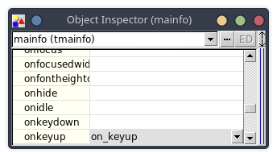
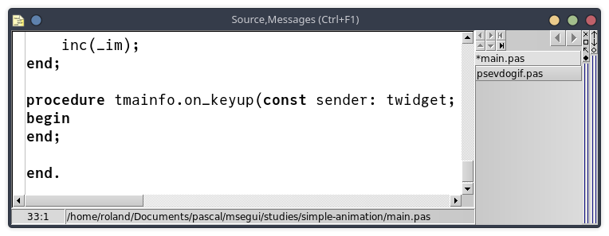
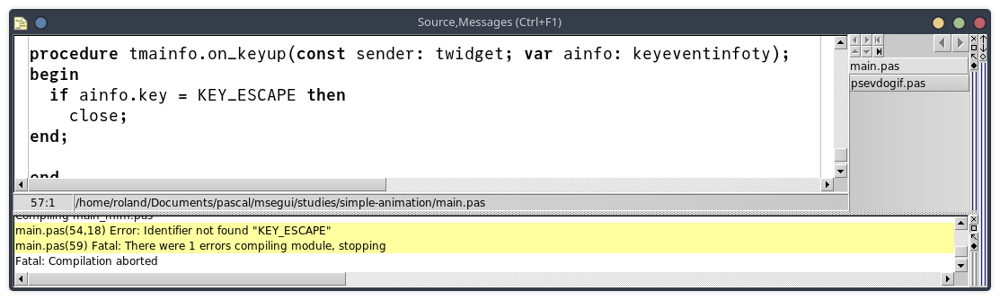

---

# Handle keyboard events





```pascal
procedure tmainfo.on_keyup(const sender: twidget; var ainfo: keyeventinfoty);
begin
  if ainfo.key = KEY_ESCAPE then
    close;
end;
```



```pascal
uses
  { ... }
  msebitmap,
  msekeyboard; { KEY_ESCAPE }
```
  ---

- [FAQ Summary](index.html)
