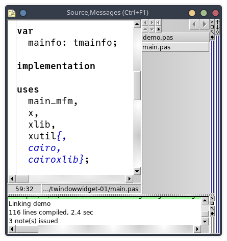

---

# Change MSEide fonts

To begin, let's choose the font for the source editor (the *Source* window of *MSEide*).

## Change editor font in project options

The font of the source editor can be chosen in the project options.

For example, here is a project where I replaced the default value (`mseide_source`) with `SourceCode-Pro`:


## Change the font via the command line

You can also choose the editor's font in the command line used to start *MSEide*. This is done using the `--FONTALIAS` option.

Here is the *mseide_xxx.desktop* file which I use to launch one of the *MSEide* versions installed on my machine from my desktop. (I chose the *Julia Mono* font, after reading this [interesting page](https://www.teuderun.de/schriftarten/top-10/).)

```
[Desktop Entry]
Version=1.0
Type=Application
Name=MSEide maint
Exec=/home/roland/msegui_xxx/apps/ide/mseide --globstatfile=/home/roland/msegui_xxx/apps/ide/mseide.sta --FONTALIAS=mseide_source,JuliaMono,18 %F
Icon=/home/roland/msegui_xxx/msegui_64.png
Path=/home/roland/msegui_xxx/apps/ide
```



## Change menu font

The menu font can be changed in the same way, as follows:

```
--FONTALIAS=stf_menu,sans,16
```


Or:

```
--FONTALIAS=stf_default,,16
```

## Eureka

I realize while writing this article (and rereading old discussions in the process) that the `--FONTALIAS` option works not only for *MSEide*, but for all applications based on *MSEgui*!

```
./chessboard --FONTALIAS=stf_menu,courier,20
```


---

- [FAQ Summary](index.html)
