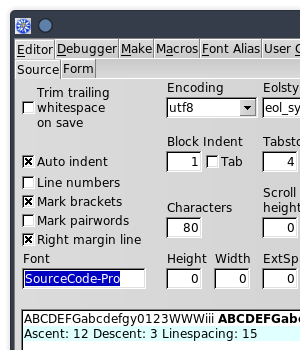
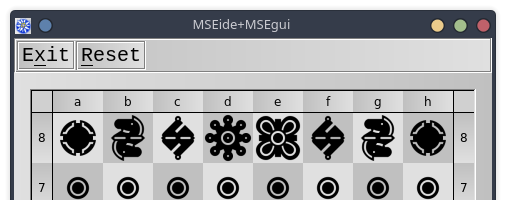

---

# Changer la police de MSEide

Il est possible de changer la police utilisée par l'éditeur de source (la fenêtre *Source* de *MSEide*). Le changement peut se faire projet par projet, ou globalement.

## Changer la police dans les options du projet

Par exemple, voici un projet où j'ai remplacé la valeur par défaut (`mseide_source`) par `SourceCode-Pro` :



## Changer la police dans la ligne de commande

On peut aussi choisir la police de l'éditeur dans la ligne de commande servant à démarrer *MSEide*. On utilise pour cela l'option `--FONTALIAS`.

Pour illustration, voici le fichier *mseide_xxx.desktop* qui me sert à lancer depuis mon bureau l'une des versions de *MSEide* installées sur ma machine. (J'ai choisi la police *Julia Mono*, après lecture de cette [intéressante page](https://www.teuderun.de/schriftarten/top-10/).)

```
[Desktop Entry]
Version=1.0
Type=Application
Name=MSEide maint
Exec=/home/roland/msegui_xxx/apps/ide/mseide --globstatfile=/home/roland/msegui_xxx/apps/ide/mseide.sta --FONTALIAS=mseide_source,JuliaMono,18 %F
Icon=/home/roland/msegui_xxx/msegui_64.png
Path=/home/roland/msegui_xxx/apps/ide
```


## Changer la police des menus

On peut changer de la même façon la police des menus, de la façon suivante :

```
--FONTALIAS=stf_menu,sans,16
```


Ou encore :

```
--FONTALIAS=stf_default,,16
```

## Découverte

Je m'aperçois en écrivant cet article (et en relisant d'anciennes discussions) que l'option `--FONTALIAS` fonctionne pour toutes les applications basées sur MSEgui !

```
./chessboard --FONTALIAS=stf_menu,courier,20
```



---

- [Sommaire FAQ](index.html)
